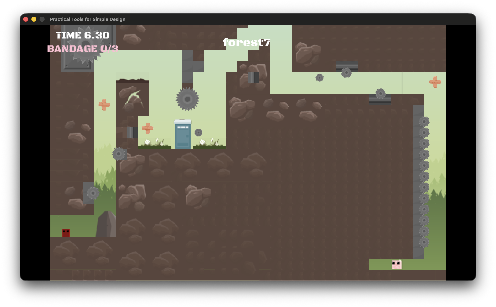

# 2026 OOPL Final Report

## 組別資訊

- **組別：** T21
- **組員：** 113AC1012 陳俊佑
- **復刻遊戲：** 超級肉肉哥 Super Meat Boy

---

## 專案簡介

### 遊戲簡介

《超級肉肉哥》（Super Meat Boy）是一款以「精準操作」與「極速重生」聞名的高難度平台遊戲。玩家扮演一塊方方正正、顏色深紅、猶如肉塊的「肉肉哥」（Meat Boy），目標是穿越佈滿電鋸與陷阱的關卡，營救被大反派「胎兒博士」（Dr. Fetus）綁架的女朋友「繃帶妹」（Bandage Girl）。

本專案以 **C++** 搭配課程使用的 **PTSD（Practical Tools for Simple Design）** 框架，重現原作的核心手感：靈敏的水平加速、滑牆與牆壁跳，以及碰到陷阱「死亡即刻重置、瞬間回到起點」的快節奏循環。並在此基礎上自行擴充了**繃帶收集品、可解鎖角色、通關評分（A+/A）與通關過場演出**等系統。

本專案為個人專案，原始碼採模組化分層架構，所有關卡與數值皆以 **TMX 地圖檔** 與 **JSON 設定檔** 外部化驅動。

### 組別分工

本專案由 **陳俊佑（113AC1012）** 一人獨立完成，工作涵蓋下列所有模組：

| 模組 | 內容 |
|------|------|
| 物理與操作 | 水平加速/摩擦、可變高度跳躍、土狼時間、輸入緩衝、滑牆、牆壁跳 |
| 碰撞系統 | AABB X/Y 軸獨立解算、可破壞平台、出界偵測 |
| 關卡系統 | TMX 地圖載入、Tilemap 渲染、世界/關卡選擇 |
| 攝影機 | 死區追隨、速度預判、邊界限制、通關放大過場 |
| 危險物與敵人 | 動畫鋸、飛鋸發射器、旋轉鋸、Boss（Lil' Slugger）追擊 |
| 道具與進度 | 繃帶收集品 + HUD、可解鎖角色、評分系統、存檔 |
| UI / 選單 | 標題、設定（音量）、暫停、角色選擇、通關畫面 |
| 工程 | JSON/TMX 資料驅動、模組化重構、設定/進度持久化 |

---

## 遊戲介紹

### 遊戲規則

**目標**：操控肉肉哥從出生點抵達繃帶妹（終點），途中避開所有鋸類陷阱。

**操作方式**

| 按鍵 | 功能 |
|------|------|
| `A` / `D`（或 `←` / `→`） | 左右移動 |
| `Space` / `W` | 跳躍（長按可跳更高，短按為小跳） |
| 貼牆下落 | 自動滑牆；滑牆時按跳 → 牆壁跳 |
| `Shift` | 衝刺（加速） |
| `R` | 手動重生 |
| `ESC` | 暫停選單 |
| `F2` | 作弊模式：碰到鏈鋸不死（除錯/展示用） |
| `N` | 通關後進入下一關 |

**核心機制**

- **死亡即刻重置**：碰到任何鋸類陷阱（動畫鋸 / 飛鋸 / 旋轉鋸）立即回到出生點，地圖動態狀態（Boss、可破壞物、飛鋸）一併重置，重生無讀條，鼓勵高速試錯。
- **繃帶收集品**：地圖上散佈繃帶（位置寫在 TMX 中），碰觸即收集，數量累計於跨關卡全域進度並存檔。
- **可解鎖角色**：以累積繃帶數達門檻解鎖客串角色（如橘色肉肉哥），可在「CHANGE CHARACTER」畫面切換。
- **通關評分**：每關依**地圖大小自動換算 A+ 門檻秒數**；於時間內通關得 **A+**，超過則得 **A**。通關時鏡頭放大聚焦主角與繃帶妹，呈現過場演出。

### 遊戲畫面

| 畫面 | 說明 |
|------|------|
| 標題畫面 | PRESS START → 主選單（START GAME / CHARACTERS / SETTINGS / EXIT） |
| 世界選擇 | 選擇 Forest / Factory 等世界 |
| 關卡選擇 | 以節點呈現各關，含 Boss 關 |
| 遊戲畫面 | 左上 HUD 顯示計時器與繃帶數量，頂端顯示關卡名 |
| 設定 | 拖曳調整 BGM / SFX 音量，數值存檔 |
| 角色選擇 | 左右切換角色、顯示名稱/描述/解鎖門檻、左上角繃帶總數 |
| 通關畫面 | LEVEL COMPLETE + GRADE A+/A，鏡頭放大聚焦主角與繃帶妹 |

> 對應截圖見 `Resources/images/screenshot1.png` ~ `screenshot4.png`



---

## 程式設計

### 程式架構

本專案採「框架層 → 遊戲層 → 主控層」的分層設計，並以命名空間切分模組職責：

| 命名空間 | 職責 | 目錄 |
|---------|------|------|
| `Core::` | 底層 OpenGL/SDL 原語（Drawable、Context 等） | `PTSD/include/Core/` |
| `Util::` | 通用工具（GameObject、Renderer、Animation、Image、Text） | `PTSD/include/Util/` |
| `Game::` | 遊戲領域邏輯（Aabb、LevelData、TmxLoader、BoxDrawable） | `include/game/` |
| `Common::` | 專案通用工具（資源路徑解析） | `include/common/` |

**渲染體系類別關係**

```
Core::Drawable（抽象基底，純虛擬 Draw() / GetSize()）
   ├── Util::Image      （靜態圖片）
   ├── Util::Text       （文字）
   ├── Util::Animation  （逐幀動畫）
   └── Game::BoxDrawable（不可見碰撞框）

Util::GameObject  ──持有──> Core::Drawable*（多型）
Util::Renderer    ──管理──> vector<GameObject>（依 zIndex 渲染）
```

**主控層 `App` 的模組化拆分**

`App` 是整個遊戲的主控制器，並刻意依「系統」拆分為多個 `.cpp`，避免單一巨大檔案：

| 檔案 | 負責系統 |
|------|---------|
| `AppStart.cpp` | 世界初始化、關卡載入、物件生成 |
| `AppUpdate.cpp` | 主迴圈分派（選單層級 → 遊戲） |
| `AppMovement.cpp` | 玩家物理與輸入 |
| `AppPlayer.cpp` | 動畫狀態機、重生、關卡狀態重置 |
| `AppCollision.cpp` | AABB 碰撞解算 |
| `AppCamera.cpp` | 攝影機追隨、通關鏡頭、評分 |
| `AppShooter.cpp` / `AppRotor.cpp` / `AppBoss.cpp` | 飛鋸 / 旋轉鋸 / Boss |
| `AppBandage.cpp` | 繃帶收集品 + HUD |
| `AppCharacter.cpp` | 角色解鎖與套用 |
| `AppMenu.cpp` | 標題 / 暫停 / 設定 / 角色選擇 UI |
| `AppConfig.cpp` | JSON 設定載入 |

**資料驅動設計**

- **關卡**：以 Tiled 編輯器產出 `.tmx`，由 `Game::TmxLoader` 解析出平台、鋸子、出生點、終點、繃帶等物件。
- **數值**：`Resources/config/gameplay.json` 外部化所有可調參數（物理常數、攝影機、音量、繃帶、評分門檻、角色清單、UI 位置等），改數值免重編譯。

### 程式技術

**1. 物件導向三大支柱**

- **封裝（Encapsulation）**：`App` 將所有遊戲狀態設為 `private`，對外僅暴露 `Start()/Update()/End()` 生命週期；以內嵌 `struct`（如 `BreakableBlock`、`Bandage`、`CharacterDef`）把相關屬性聚合管理。
- **繼承（Inheritance）**：所有可繪製物件繼承抽象基底 `Core::Drawable` 並實作純虛擬 `Draw()`、`GetSize()`；專案自定義 `Game::BoxDrawable`（`final`）作為「只有尺寸、不繪製」的隱形碰撞框。
- **多型（Polymorphism）**：`Util::GameObject` 持有 `shared_ptr<Core::Drawable>`，同一個玩家物件在 IDLE/RUN/JUMP/FALL 狀態下動態替換不同子類別 drawable，渲染端無感知地正確繪製。

**2. 設計模式**

| 模式 | 應用 |
|------|------|
| 單例 Singleton | `Core::Context` 管理 SDL 視窗 / OpenGL context，禁止複製與移動 |
| 組合 Composite | `Util::Renderer` + `Util::GameObject` 樹狀場景圖 |
| 策略 Strategy | `Util::AssetStore<T>` 以注入 loader 函式抽換不同資產載入策略 |

**3. 狀態機（Enum Class）**

以強型別 `enum class` 搭配 `switch` 實作多個狀態機：`App::State`（遊戲流程）、`PlayerAnimState`（動畫）、`BossPhase`（Boss 行為：WAITING→CHASING→RUSHING→CRASHED）、`TitlePhase`（標題）。

**4. 物理與手感**

AABB 碰撞採 **X / Y 軸獨立解算**避免卡角；跳躍加入**可變高度、土狼時間（Coyote Time）、輸入緩衝（Input Buffer）**；並實作滑牆與牆壁跳。`AppCollision.cpp` 以 Lambda `resolveAgainst` 封裝單一平台碰撞解算邏輯，複用於一般平台與可破壞方塊（單一職責原則）。

**5. 攝影機**

死區（dead-zone）追隨 + 速度預判（lookahead）+ 邊界鉗制；通關時平滑插值放大並聚焦主角與終點中點。

**6. 資源管理**

全專案以 `std::shared_ptr` 管理物件生命週期（共享所有權、自動釋放）；設定與進度以檔案 I/O 持久化（`audio_settings.txt`、`player_progress.txt`）。

**7. 第三方函式庫**

`nlohmann/json`（JSON 解析）、`tmxlite`（TMX 解析）、PTSD/SDL2/OpenGL（視窗與渲染）。

### 使用到 AI/AI Agent 的部分

本專案在開發中段起，導入 **Claude Code（Anthropic 的 agentic 程式開發 CLI）** 作為結對開發的 AI Agent，協助實作與除錯。

**運作流程**：以自然語言（常搭配遊戲截圖）描述需求 → Agent 自行探索現有程式碼、找出相關檔案與既有慣例 → 依專案風格提出並實作修改 → 編譯與驗證 → 我審閱、實機測試後再迭代。

**實際協作完成的功能 / 修正（節錄）**：

| 類型 | 項目 |
|------|------|
| 功能 | 繃帶收集品 + 計時器/數量 HUD（位置寫在 TMX、細節存 JSON） |
| 功能 | 可解鎖角色系統 + 「CHANGE CHARACTER」選擇 UI（累積門檻解鎖、存檔） |
| 功能 | 通關畫面（LEVEL COMPLETE + GRADE）、依地圖大小自動評分 A+/A、通關放大鏡頭 |
| 功能 | 作弊模式（F2 碰鋸不死）與畫面提示字 |
| 修正 | 攝影機渲染到地圖上方露出黑邊 → 視野高於地圖時改為頂端對齊 |
| 修正 | 換色角色貼圖尺寸不一（300×300 vs 20×20）導致主角過大/壞掉 → 正規化到一致世界高度 |
| 修正 | 移動狀態機：向右跑直接反向往左時動畫卡在右跑圖 → 朝向改變時強制重貼圖 |
| 修正 | HUD 文字置中錨點導致左上角被切 → 水平右移 |

**心得與分際**：AI Agent 對於「在大型既有程式碼中快速定位、遵循既有慣例擴充、解釋 bug 根因」特別有幫助；但需求拆解、設計取捨、實機測試與最終驗收仍由我主導。所有由 Agent 產出的程式碼皆經人工審閱後才採用。

---

## 結語

### 問題與解決方法

| 問題 | 根本原因 | 解決方法 |
|------|---------|---------|
| 攝影機向上渲染時露出地圖上方黑邊 | 視野比地圖高時，舊邏輯把鏡頭置中，使上緣超出地圖頂端 | 該情況改為「頂端對齊地圖上邊界」，多餘空白落到下方 |
| 換成橘色角色後主角變超大、卡進地形 | 角色縮放/碰撞框 = 圖片像素 × 固定 scale；橘圖 300×300 遠大於紅圖 20×20，放大約 15 倍 | 以預設角色高度為基準，把每個角色正規化到相同世界高度並重算碰撞框 |
| 向右跑不停直接往左跑，動畫仍是右跑圖 | 動畫去重只比較狀態（RUN），未含左右朝向，快速反向時 early-return 跳過重貼圖 | 記錄目前跑步圖朝向，朝向改變時即使仍是 RUN 也強制重貼 |
| 左上角 TIME / BANDAGE 文字被切掉 | 文字為置中錨點，較寬字串往左超出畫面邊界 | 將 HUD 文字位置水平右移 |

### 自評

| 項次 | 項目                   | 完成 |
|------|------------------------|-------|
| 1    | 這是範例 |  V  |
| 2    | 完成專案權限改為 public |  V  |
| 3    | 具有 debug mode 的功能  |  V  |
| 4    | 解決專案上所有 Memory Leak 的問題  |  V  |
| 5    | 報告中沒有任何錯字，以及沒有任何一項遺漏  |  V  |
| 6    | 報告至少保持基本的美感，人類可讀  |  V  |

> 說明：第 3 項 debug mode 以 `F2` 作弊（鏈鋸無敵）模式與大量 `LOG_INFO` 除錯輸出實現；第 4 項全專案以 `std::shared_ptr` 管理物件生命週期，無手動 `new/delete`，避免記憶體洩漏。

### 心得

從零開始用 PTSD 框架復刻《Super Meat Boy》，最大的收穫是體會到「手感」其實是無數小數值與邊界條件堆出來的：跳躍的可變高度、土狼時間、輸入緩衝、滑牆與牆壁跳，每一項都需要反覆微調。也因此我把所有可調參數抽到 JSON、關卡抽到 TMX，讓「調整」與「重編譯」脫鉤，開發效率大幅提升。

在架構上，PTSD 的 `Drawable` / `GameObject` / `Renderer` 讓我實際感受到封裝、繼承、多型如何協同運作——主角只要換掉手上的 `Drawable`，整個渲染系統就無感地正確運作；把 `App` 依系統拆成多個 `.cpp` 也讓後期加功能時不至於牽一髮動全身。

導入 AI Agent 協作後，我更能專注在「想做什麼、怎麼設計、好不好玩」，把繁瑣的程式碼定位與樣板實作交給工具，再由自己審閱驗收。整體而言，這個專案讓我把課堂上的 OOP 概念真正落地成一個可遊玩、可擴充的作品。

### 貢獻比例

| 組員 | 貢獻比例 |
|------|---------|
| 113AC1012 陳俊佑 | 100% |
