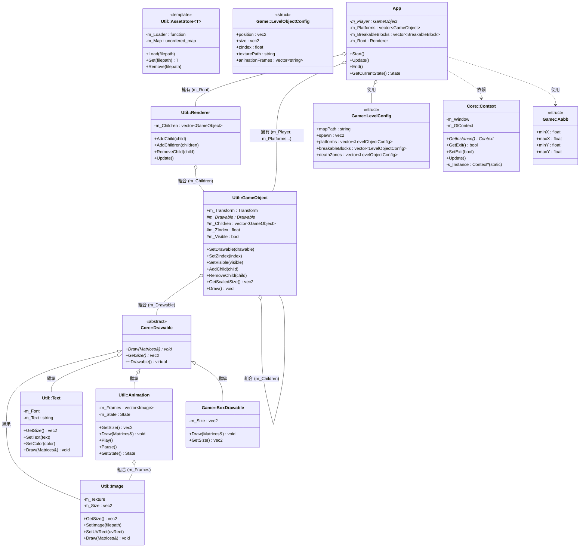

# 物件導向技術應用說明文件

> 專案：2026-OOPL-Super-Meat-Boy（C++ / PTSD 框架）

---

## 一、整體類別架構圖



---

## 二、OOP 三大核心概念的應用

### 2.1 封裝（Encapsulation）

封裝是將資料與操作資料的行為包裝在一起，並透過存取控制隱藏內部細節。

#### (A) `App` 類別 — 遊戲主控封裝

**檔案：** [App.hpp](file:///Users/nariaki/Documents/2026-OOPL-Super-Meat-Boy/include/App.hpp)

`App` 類別是整個遊戲的主控制器，完整示範了封裝原則：

| 存取層級 | 成員 | 說明 |
|---------|------|------|
| `public` | `Start()`, `Update()`, `End()` | 唯一對外的遊戲生命週期介面 |
| `public` | `GetCurrentState()` | 唯讀 getter，不允許外部直接修改狀態 |
| `private` | `InitWorld()`, `LoadLevel()`, `StepPlayer()` | 內部實作細節，完全隱藏 |
| `private` | `m_Player`, `m_Platforms`, `m_PlayerVelocity` | 所有遊戲狀態資料均為私有 |

```cpp
// 外部只能看到乾淨的介面
class App {
public:
    State GetCurrentState() const { return m_CurrentState; }  // 唯讀 getter
    void Start();
    void Update();
    void End();

private:
    // 所有內部狀態對外完全不可見
    glm::vec2 m_PlayerVelocity = {0.0F, 0.0F};
    bool m_IsJumping = false;
    float m_JumpHoldTimerMs = 0.0F;
    // ...
};
```

#### (B) `App::BreakableBlock` — 內嵌結構體封裝

**檔案：** [App.hpp](file:///Users/nariaki/Documents/2026-OOPL-Super-Meat-Boy/include/App.hpp#L57-L63)

```cpp
struct BreakableBlock {
    std::shared_ptr<Util::GameObject> object;
    std::shared_ptr<Util::Animation> animation;
    glm::vec2 colliderSize = {0.0F, 0.0F};
    bool breaking = false;
    bool broken = false;
};
```

將一個可破壞方塊的所有屬性（物件、動畫、碰撞尺寸、狀態）封裝在一個結構體中，讓 `m_BreakableBlocks` 這個 vector 的管理更加清晰。

#### (C) `Core::Context` — 單例封裝

**檔案：** [Context.hpp](file:///Users/nariaki/Documents/2026-OOPL-Super-Meat-Boy/PTSD/include/Core/Context.hpp)

```cpp
class Context {
public:
    static std::shared_ptr<Context> GetInstance();  // 唯一存取點
    bool GetExit() const { return m_Exit; }
    void SetExit(bool exit) { m_Exit = exit; }

private:
    // 禁止複製與移動，強制使用單例
    Context(const Context &) = delete;
    Context(Context &&) = delete;
    Context &operator=(const Context &) = delete;
    Context &operator=(Context &&) = delete;

    SDL_Window *m_Window;      // SDL 底層視窗，對外隱藏
    SDL_GLContext m_GlContext; // OpenGL context，對外隱藏
    static std::shared_ptr<Context> s_Instance; // 靜態單例
};
```

#### (D) `Util::AssetStore<T>` — 模板類別封裝資源快取

**檔案：** [AssetStore.hpp](file:///Users/nariaki/Documents/2026-OOPL-Super-Meat-Boy/PTSD/include/Util/AssetStore.hpp)

```cpp
template <typename T>
class AssetStore {
public:
    T Get(const std::string &filepath);  // 對外只提供 Get 介面

private:
    std::function<T(const std::string &)> m_Loader; // 載入策略
    std::unordered_map<std::string, T> m_Map;       // 快取，對外完全隱藏
};
```

`Util::Image` 使用 `AssetStore<shared_ptr<SDL_Surface>>` 快取已載入的圖片，外部呼叫 `Get()` 時完全不知道快取的存在。

---

### 2.2 繼承（Inheritance）

#### (A) `Core::Drawable` — 抽象基底類別

**檔案：** [Drawable.hpp](file:///Users/nariaki/Documents/2026-OOPL-Super-Meat-Boy/PTSD/include/Core/Drawable.hpp)

這是整個渲染體系的根基，定義了所有可繪製物件必須實作的介面：

```cpp
class Drawable {
public:
    virtual ~Drawable() = default;
    virtual void Draw(const Core::Matrices &data) = 0;  // 純虛擬函式
    virtual glm::vec2 GetSize() const = 0;               // 純虛擬函式
};
```

> **設計意義**：`Core::Drawable` 是純抽象類別（不含任何資料成員），只定義行為契約，任何想要被渲染的物件都必須繼承它並實作這兩個方法。

#### (B) 繼承層次結構

| 派生類別 | 繼承自 | 所在檔案 | 用途 |
|---------|-------|---------|------|
| `Util::Image` | `Core::Drawable` | [Image.hpp](file:///Users/nariaki/Documents/2026-OOPL-Super-Meat-Boy/PTSD/include/Util/Image.hpp) | 靜態圖片渲染 |
| `Util::Text` | `Core::Drawable` | [Text.hpp](file:///Users/nariaki/Documents/2026-OOPL-Super-Meat-Boy/PTSD/include/Util/Text.hpp) | 文字渲染 |
| `Util::Animation` | `Core::Drawable` | [Animation.hpp](file:///Users/nariaki/Documents/2026-OOPL-Super-Meat-Boy/PTSD/include/Util/Animation.hpp) | 逐幀動畫渲染 |
| `Game::BoxDrawable` | `Core::Drawable` | [BoxDrawable.hpp](file:///Users/nariaki/Documents/2026-OOPL-Super-Meat-Boy/include/game/BoxDrawable.hpp) | 無圖不可見的碰撞框 |

#### (C) `Game::BoxDrawable` — 專案自定義子類別

**檔案：** [BoxDrawable.hpp](file:///Users/nariaki/Documents/2026-OOPL-Super-Meat-Boy/include/game/BoxDrawable.hpp)

```cpp
namespace Game {
class BoxDrawable final : public Core::Drawable {  // final 防止再被繼承
public:
    explicit BoxDrawable(const glm::vec2 &size)
        : m_Size(size) {}

    void Draw(const Core::Matrices &) override {}  // 刻意空實作（不繪製任何東西）
    glm::vec2 GetSize() const override { return m_Size; }

private:
    glm::vec2 m_Size;
};
}
```

> **設計意義**：`BoxDrawable` 是一個「不可見的碰撞盒」。繼承 `Core::Drawable` 是為了滿足 `Util::GameObject::SetDrawable()` 的介面要求，但 `Draw()` 故意為空，使其只提供尺寸資訊而不進行任何實際繪製。用於純碰撞邏輯而不需要對應貼圖的平台。

---

### 2.3 多型（Polymorphism）

#### (A) 執行期多型 — `Core::Drawable*` 的統一介面

**最核心的多型應用**出現在 `Util::GameObject` 中：

```cpp
// Util/GameObject.hpp
protected:
    std::shared_ptr<Core::Drawable> m_Drawable = nullptr;  // 多型指標

public:
    glm::vec2 GetScaledSize() const {
        return m_Drawable->GetSize() * m_Transform.scale;  // 虛擬呼叫
    }
```

`m_Drawable` 是一個指向 `Core::Drawable` 的 `shared_ptr`，實際上可以指向：
- `Util::Image`（靜態圖片）
- `Util::Text`（文字）
- `Util::Animation`（動畫）
- `Game::BoxDrawable`（碰撞框）

`Util::Renderer::Update()` 在更新時無需知道每個物件的具體類型，透過多型統一呼叫 `Draw()`。

#### (B) 動畫狀態的多型切換 — `ApplyPlayerDrawable()`

**檔案：** [AppPlayer.cpp](file:///Users/nariaki/Documents/2026-OOPL-Super-Meat-Boy/src/AppPlayer.cpp)

```cpp
void App::ApplyPlayerDrawable(const std::shared_ptr<Core::Drawable> &drawable) {
    if (drawable != nullptr && m_Player != nullptr) {
        m_Player->SetDrawable(drawable);  // 執行期動態替換 drawable
    }
}

void App::UpdatePlayerAnimation(const float moveAxis) {
    // ...
    switch (m_PlayerAnimState) {
    case PlayerAnimState::IDLE:
        ApplyPlayerDrawable(m_PlayerIdleDrawable);      // Util::Image
        break;
    case PlayerAnimState::RUN:
        ApplyPlayerDrawable(m_PlayerRunRightDrawable);  // Util::Image
        break;
    // ...
    }
}
```

同一個 `m_Player` 物件，在不同狀態下持有不同類型的 `Core::Drawable` 子類別物件，整個渲染系統無感知地正確渲染——這是多型的典型應用。

#### (C) `App::State` — Enum Class 的型別安全多型

**檔案：** [App.hpp](file:///Users/nariaki/Documents/2026-OOPL-Super-Meat-Boy/include/App.hpp#L24-L28) / [main.cpp](file:///Users/nariaki/Documents/2026-OOPL-Super-Meat-Boy/src/main.cpp)

```cpp
enum class State {
    START,
    UPDATE,
    END,
};
```

```cpp
// main.cpp
switch (app.GetCurrentState()) {
    case App::State::START:  app.Start();  break;
    case App::State::UPDATE: app.Update(); break;
    case App::State::END:    app.End(); context->SetExit(true); break;
}
```

使用強型別 `enum class` 取代整數或字串，透過 `switch` 實現「輸入不同狀態 → 呼叫不同行為」的編譯期多型。

#### (D) `App::PlayerAnimState` — 動畫狀態機

**檔案：** [App.hpp](file:///Users/nariaki/Documents/2026-OOPL-Super-Meat-Boy/include/App.hpp#L17-L22)

```cpp
enum class PlayerAnimState {
    IDLE,
    RUN,
    JUMP,
    FALL,
};
```

在 `UpdatePlayerAnimation()` 中，根據物理狀態（是否在地面、速度大小）決定 `PlayerAnimState`，再根據狀態切換不同的 `Core::Drawable` ——多層多型疊加使用。

---

## 三、其他重要 OOP 設計模式

### 3.1 單例模式（Singleton Pattern）— `Core::Context`

**檔案：** [Context.hpp](file:///Users/nariaki/Documents/2026-OOPL-Super-Meat-Boy/PTSD/include/Core/Context.hpp)

```cpp
class Context {
public:
    static std::shared_ptr<Context> GetInstance();  // 全域唯一存取點
private:
    static std::shared_ptr<Context> s_Instance;     // 靜態唯一實例
    Context(const Context &) = delete;              // 禁止複製
    Context(Context &&) = delete;                   // 禁止移動
};
```

`Core::Context` 管理 SDL 視窗與 OpenGL context，整個程式中只能有一個實例，`GetInstance()` 保證多次呼叫都回傳同一個物件。

**使用處：**
```cpp
// main.cpp
auto context = Core::Context::GetInstance();
```

---

### 3.2 組合模式（Composite Pattern）— `Util::GameObject` + `Util::Renderer`

**架構說明：**

```
Util::Renderer
  └── m_Children : vector<shared_ptr<GameObject>>
        ├── m_Player (GameObject)
        │     └── m_Drawable: Util::Image (Drawable)
        ├── Platform (GameObject)
        │     └── m_Drawable: Util::Image (Drawable)
        ├── BreakableBlock (GameObject)
        │     └── m_Drawable: Util::Animation (Drawable)
        ├── DeathZone (GameObject)
        │     └── m_Drawable: Util::Animation (Drawable)
        └── StatusBoard (GameObject)
              └── m_Drawable: Util::Text (Drawable)
```

`Util::Renderer` 統一管理一組 `Util::GameObject`，呼叫 `Update()` 時，依各物件的 `m_ZIndex` 排序並逐一渲染，而不用知道每個物件的具體類型。

`Util::GameObject` 本身也支援樹狀結構（`m_Children`），可以在物件下再掛子物件。

---

### 3.3 策略模式（Strategy Pattern）— `Util::AssetStore<T>`

**檔案：** [AssetStore.hpp](file:///Users/nariaki/Documents/2026-OOPL-Super-Meat-Boy/PTSD/include/Util/AssetStore.hpp)

```cpp
template <typename T>
class AssetStore {
public:
    AssetStore(std::function<T(const std::string &)> loader) // 注入載入策略
        : m_Loader(loader) {}
    // ...
private:
    std::function<T(const std::string &)> m_Loader; // 可抽換的載入策略
};
```

`AssetStore` 透過建構子注入一個 `loader` 函式物件（Strategy），不同的資產類型（圖片、字型等）注入不同的 loader，但快取邏輯完全相同——策略模式讓 `AssetStore` 具備高度複用性。

---

### 3.4 命名空間（Namespace）作為模組化手段

| 命名空間 | 職責 | 對應目錄 |
|---------|------|---------|
| `Core::` | 底層 OpenGL/SDL 原語（Drawable、Context、Shader 等） | `PTSD/include/Core/` |
| `Util::` | 遊戲通用工具（GameObject、Renderer、Animation 等） | `PTSD/include/Util/` |
| `Game::` | 遊戲領域邏輯（Aabb、LevelData、BoxDrawable 等） | `include/game/` |
| `Common::` | 專案通用工具（資源路徑解析） | `include/common/` |

命名空間讓整個專案形成清晰的層次結構，避免名稱衝突，同時傳達各模組的職責。

---

## 四、Lambda 函式作為局部封裝

**檔案：** [AppCollision.cpp](file:///Users/nariaki/Documents/2026-OOPL-Super-Meat-Boy/src/AppCollision.cpp)

```cpp
void App::ResolvePlayerPlatformCollisions(const glm::vec2 &previousPosition) {
    // Lambda：封裝「取得玩家當前 AABB」的邏輯
    const auto makePlayerAabb = [this]() {
        return Game::MakeAabb(m_Player->m_Transform.translation,
                              m_PlayerColliderSize);
    };

    // Lambda：封裝「對單一平台進行碰撞解算」的完整邏輯（Functor 概念）
    const auto resolveAgainst = [&](const std::shared_ptr<Util::GameObject> &platform,
                                    bool *touchedTop = nullptr,
                                    const glm::vec2 *colliderSizeOverride = nullptr,
                                    const bool useRelaxedTopCheck = false) {
        // ... 約 60 行的碰撞解算邏輯被封裝在此 ...
    };

    for (const auto &platform : m_Platforms) {
        resolveAgainst(platform);  // 統一介面呼叫
    }
    for (auto &breakable : m_BreakableBlocks) {
        bool touchedTop = false;
        resolveAgainst(breakable.object, &touchedTop, &breakable.colliderSize, true);
    }
}
```

Lambda 函式 `resolveAgainst` 是一個局部的「碰撞解算策略」，同樣的邏輯被複用在普通平台和可破壞方塊上，這是 OOP 中**單一職責原則（SRP）**的體現——碰撞解算邏輯集中在一處。

---

## 五、`std::shared_ptr` 與物件所有權設計

整個專案大量使用 C++ 智慧指標管理物件生命週期：

```cpp
// 共享所有權：多個物件可同時使用同一個 Drawable
std::shared_ptr<Core::Drawable> m_PlayerIdleDrawable;   // App 持有
std::shared_ptr<Core::Drawable> m_PlayerJumpDrawable;   // 指向同一個 Image 物件

// 初始化時
m_PlayerJumpDrawable = m_PlayerIdleDrawable;  // 兩個指標指向同一個 Core::Drawable
```

這展示了 OOP 中「物件共享」的概念：`m_PlayerJumpDrawable` 和 `m_PlayerIdleDrawable` 都指向相同的 `Util::Image` 物件，節省記憶體的同時，若原始圖片更新，所有引用它的地方都能立即反映。

---

## 六、各檔案 OOP 技術對照表

| 檔案 | 主要 OOP 技術 |
|------|-------------|
| `PTSD/include/Core/Drawable.hpp` | 抽象類別、純虛擬函式 |
| `PTSD/include/Core/Context.hpp` | 單例模式、封裝、禁止複製移動 |
| `PTSD/include/Util/GameObject.hpp` | 封裝、組合、多型（持有 Drawable*）|
| `PTSD/include/Util/Renderer.hpp` | 組合模式（管理 GameObject 集合）|
| `PTSD/include/Util/Animation.hpp` | 繼承（Core::Drawable）、封裝 |
| `PTSD/include/Util/Image.hpp` | 繼承（Core::Drawable）、封裝 |
| `PTSD/include/Util/Text.hpp` | 繼承（Core::Drawable）、封裝 |
| `PTSD/include/Util/AssetStore.hpp` | 模板、策略模式、封裝 |
| `include/App.hpp` | 封裝、enum class（狀態機）、struct 封裝 |
| `include/game/BoxDrawable.hpp` | 繼承（Core::Drawable）、final 關鍵字 |
| `include/game/LevelData.hpp` | struct 資料封裝、命名空間 |
| `include/game/Collision.hpp` | struct（Aabb）、命名空間 |
| `src/AppCollision.cpp` | Lambda 封裝、SRP |
| `src/AppPlayer.cpp` | 多型切換（動畫狀態機）|
| `src/AppStart.cpp` | 組合模式建立場景層次 |
| `src/main.cpp` | 多型分派（狀態機 switch）|
